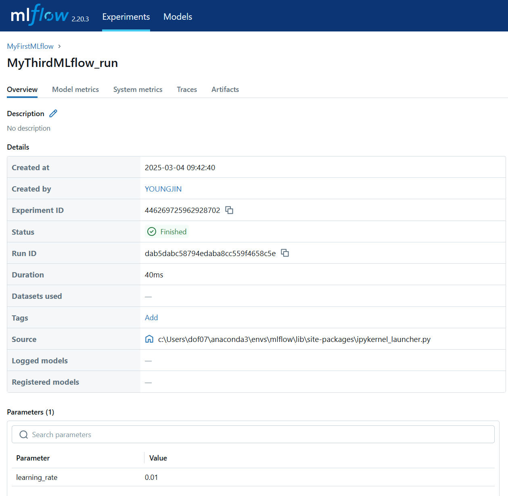

#### Ways to run MLflow

#### You can explicitly specify `start_run()` and `end_run()`


```python
import mlflow

if __name__=="__main__":

    # Which experiemnt you are working on
    mlflow.set_experiment(experiment_id="446269725962928702")

    # start a new mlflow run
    mlflow.start_run(run_name="MyFirstMLflow_run")

    # Your ML code goes here
    mlflow.log_param("learning_rate", 0.01)

    # End the mlflow run
    mlflow.end_run()
```




#### Or you can use `with` to start and end the run


```python
import mlflow

if __name__=="__main__":

    with mlflow.start_run(run_name="MySecondMLflow_run", experiment_id = "446269725962928702") as run:

        # Your ML code goes here
        mlflow.log_param("learning_rate", 0.01)

        print("Run ID: ", run.info.run_id)
        print("Run Info: ", run.info)
```

    Run ID:  4e24e3f695574503bd49df5961f37ec3
    Run Info:  <RunInfo: artifact_uri='file:///c:/Users/dof07/Desktop/mlflow/MyFirstMLflow_artifact_loc/4e24e3f695574503bd49df5961f37ec3/artifacts', end_time=None, experiment_id='446269725962928702', lifecycle_stage='active', run_id='4e24e3f695574503bd49df5961f37ec3', run_name='MySecondMLflow_run', run_uuid='4e24e3f695574503bd49df5961f37ec3', start_time=1741048851677, status='RUNNING', user_id='YOUNGJIN'>
    


#### 


```python
import mlflow
from mlflow_utils import create_mlflow_experiment
from mlflow_utils import get_mlflow_experiment

if __name__ == "__main__":

    # 1. Create an experiment with name "MyFirstMLflow" if not exist
    experiment_id = create_mlflow_experiment(
        experiment_name = "MyFirstMLflow",
        artifact_location="MyFirstMLflow_artifact_loc",
        tags={"env":"dev", "version":"1.0.0"},
    )

    # 2. Retrieve the info
    experiment = get_mlflow_experiment(experiment_id=experiment_id)
    print("Experiment name: {}".format(experiment.name))

    # 3. Run MLflow
    with mlflow.start_run(run_name="MyThirdMLflow_run", experiment_id = experiment.experiment_id) as run:

        # Your ML code goes here
        mlflow.log_param("learning_rate", 0.01)

        # Print run info
        print("Run ID: {}".format(run.info.run_id), "\n",
              "Experiment ID: {}".format(run.info.experiment_id), "\n",
              "Status: {}".format(run.info.status), "\n",
              "Start time: {}".format(run.info.start_time), "\n",
              "End time: {}".format(run.info.end_time), "\n",
              "Lifecycle_stage: {}".format(run.info.lifecycle_stage))
        
```

    Experiment MyFirstMLflow already exists.
    Experiment name: MyFirstMLflow
    Run ID: dab5dabc58794edaba8cc559f4658c5e 
     Experiment ID: 446269725962928702 
     Status: RUNNING 
     Start time: 1741048960551 
     End time: None 
     Lifecycle_stage: active
    


```python

```
