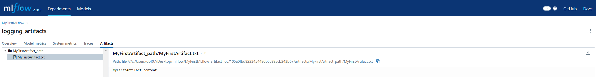

### Logging hyper-parametres, metrics, artifacts, images and models

#### Logging hyper-parametres


```python
import mlflow
from mlflow_utils import get_mlflow_experiment

if __name__ == "__main__":

    experiment = get_mlflow_experiment(experiment_name="MyFirstMLflow")
    print("Experiment ID: {}".format(experiment.experiment_id))
    
    # Which experiemnt you are working on
    with mlflow.start_run(run_name="logging_params", experiment_id = experiment.experiment_id) as run:

        # Your ML code goes here
        mlflow.log_param("learning_rate", 0.01)

        parametres = {
            "learning_rate": 0.01,
            "epochs": 10,
            "batch_size": 100,
            "loss_function": "mse",
            "optimizer": "adam",
        }

        mlflow.log_params(parametres)

        # Print run info
        print("Run ID: {}".format(run.info.run_id), "\n",
              "Experiment ID: {}".format(run.info.experiment_id), "\n",
              "Status: {}".format(run.info.status), "\n",
              "Start time: {}".format(run.info.start_time), "\n",
              "End time: {}".format(run.info.end_time), "\n",
              "Lifecycle_stage: {}".format(run.info.lifecycle_stage))
        
```

    Experiment ID: 446269725962928702
    Run ID: 52f1730fe8f348d5885e5c2c175d5a96 
     Experiment ID: 446269725962928702 
     Status: RUNNING 
     Start time: 1741049653594 
     End time: None 
     Lifecycle_stage: active
    


#### Logging metrics


```python
import mlflow
from mlflow_utils import get_mlflow_experiment

if __name__ == "__main__":

    experiment = get_mlflow_experiment(experiment_name="MyFirstMLflow")
    print("Experiment ID: {}".format(experiment.experiment_id))
    
    with mlflow.start_run(run_name="logging_metrics", experiment_id = experiment.experiment_id) as run:

        # Your ML code goes here

        ## option 1
        mlflow.log_metric("random_metric", 0.001)

        ## option 2
        metrics = {
            "mse": 0.01,
            "mae": 0.1,
            "rmse": 10,
            "r2": 100,
        }
        mlflow.log_metrics(metrics)

        # Print run info
        print("Run ID: {}".format(run.info.run_id), "\n",
              "Experiment ID: {}".format(run.info.experiment_id), "\n",
              "Status: {}".format(run.info.status), "\n",
              "Start time: {}".format(run.info.start_time), "\n",
              "End time: {}".format(run.info.end_time), "\n",
              "Lifecycle_stage: {}".format(run.info.lifecycle_stage))
        
```

    Experiment ID: 446269725962928702
    Run ID: 5d8452d2eb8d4205b4372796f007c3e4 
     Experiment ID: 446269725962928702 
     Status: RUNNING 
     Start time: 1741049783932 
     End time: None 
     Lifecycle_stage: active
    


#### Logging artifacts


```python
import mlflow
from mlflow_utils import get_mlflow_experiment

if __name__ == "__main__":

    experiment = get_mlflow_experiment(experiment_name="MyFirstMLflow")
    print("Experiment ID: {}".format(experiment.experiment_id))
    
    with mlflow.start_run(run_name="logging_artifacts" ,experiment_id = experiment.experiment_id) as run:

        # Your ML code goes here
        with open("MyFirstArtifact.txt", "w") as f:
            f.write("MyFirstArtifact content")

        mlflow.log_artifact(local_path="MyFirstArtifact.txt" # from your local machine
                           ,artifact_path="MyFirstArtifact_path") # to your MLflow path

        # Print run info
        print("Run ID: {}".format(run.info.run_id), "\n",
              "Experiment ID: {}".format(run.info.experiment_id), "\n",
              "Status: {}".format(run.info.status), "\n",
              "Start time: {}".format(run.info.start_time), "\n",
              "End time: {}".format(run.info.end_time), "\n",
              "Lifecycle_stage: {}".format(run.info.lifecycle_stage))
```

    Experiment ID: 446269725962928702
    Run ID: 105a0fbd8223454490b5c885cb243b67 
     Experiment ID: 446269725962928702 
     Status: RUNNING 
     Start time: 1741050008174 
     End time: None 
     Lifecycle_stage: active
    




#### Logging artifacts from local directory


```python
import mlflow
from mlflow_utils import get_mlflow_experiment

if __name__ == "__main__":

    experiment = get_mlflow_experiment(experiment_name="MyFirstMLflow")
    print("Experiment ID: {}".format(experiment.experiment_id))

    with mlflow.start_run(run_name="logging_artifacts2", experiment_id = experiment.experiment_id) as run:

        # Your ML code goes here
        mlflow.log_artifacts(local_dir="./MyArtifacts", artifact_path="MySecondArtifact_path")

        # Print run info
        print("Run ID: {}".format(run.info.run_id), "\n",
              "Experiment ID: {}".format(run.info.experiment_id), "\n",
              "Status: {}".format(run.info.status), "\n",
              "Start time: {}".format(run.info.start_time), "\n",
              "End time: {}".format(run.info.end_time), "\n",
              "Lifecycle_stage: {}".format(run.info.lifecycle_stage))
```

    Experiment ID: 446269725962928702
    Run ID: 6739ab2154434f2aa9b68aa667a00fd1 
     Experiment ID: 446269725962928702 
     Status: RUNNING 
     Start time: 1741050506142 
     End time: None 
     Lifecycle_stage: active
    


