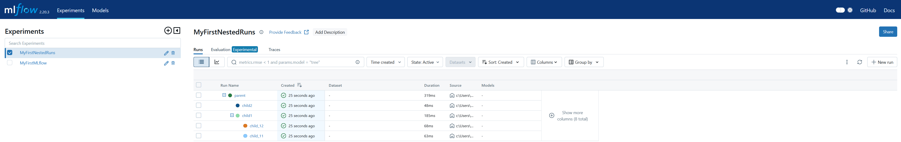

## Nested MLflow Runs

#### For any child run, you have to specify `nested=True`


```python
import mlflow
from mlflow_utils import create_mlflow_experiment

experiment_id = create_mlflow_experiment(
    experiment_name= "MyFirstNestedRuns",
    artifact_location= "my_first_nested_run_artifacts_loc",
    tags={"env":"dev"}
)

print("Experiment ID:", experiment_id)

with mlflow.start_run(experiment_id=experiment_id, run_name="parent") as parent:
    print("RUN ID parent:", parent.info.run_id)

    mlflow.log_param("parent_param", "parent_value")

    with mlflow.start_run(experiment_id=experiment_id, run_name="child1",nested=True) as child1:
        print("RUN ID child1:", child1.info.run_id)
        mlflow.log_param("child1_param", "child1_value")

        with mlflow.start_run(experiment_id=experiment_id, run_name="child_11", nested=True) as child_11:
            print("RUN ID child_11:", child_11.info.run_id )
            mlflow.log_param("child_11_param", "child_11_value")

        with mlflow.start_run(experiment_id=experiment_id, run_name="child_12", nested=True) as child_12:
            print("RUN ID child_12:", child_12.info.run_id)
            mlflow.log_param("child_12_param", "child_12_value")

    with mlflow.start_run(experiment_id=experiment_id, run_name="child2", nested=True) as child2:
        print("RUN ID child2:", child2.info.run_id)
        mlflow.log_param("child2_param", "child2_value")
```

    Experiment ID: 838942086944409807
    RUN ID parent: 339f8840eb8a40a68648e5214702cb50
    RUN ID child1: 877588a82e0f4af2b63311b5015d8538
    RUN ID child_11: d6bbad47bce34b98b08c2b8e72437532
    RUN ID child_12: 1cd3ebffb1bf435586a7c29b8f0ed3b0
    RUN ID child2: b79c33f6427e4c53a19e73608098d81a
    




