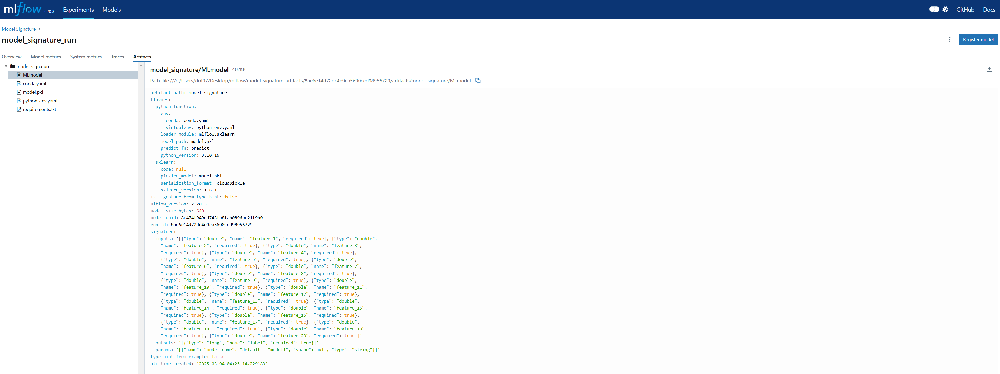

## Model Signiture with MLflow

#### Model signiture is an object that allows us to specify the data type and shape that the model can work on.

#### You can build a model signiture using `mlflow.types.schema`


```python
import mlflow
from mlflow_utils import create_mlflow_experiment
from mlflow.models.signature import ModelSignature
from mlflow.models.signature import infer_signature
from mlflow.types.schema import Schema
from mlflow.types.schema import ParamSchema
from mlflow.types.schema import ParamSpec
from mlflow.types.schema import ColSpec
from sklearn.ensemble import RandomForestClassifier
from sklearn.datasets import make_classification
import pandas as pd
from typing import Tuple

def get_train_data() -> Tuple[pd.DataFrame]:
    """
    Generate train and test data.

    :return: x_train,y_train
    """
    X, y = make_classification()
    features = [f"feature_{i+1}" for i in range(X.shape[1])]
    df = pd.DataFrame(X, columns=features)
    df["label"] = y

    return df[features], df["label"]
```


```python
X_train, y_train = get_train_data()

print(X_train.head())
# print(y_train.head())
print(X_train.info())
```

       feature_1  feature_2  feature_3  feature_4  feature_5  feature_6  \
    0  -1.201183   1.016247   0.048663   0.244420  -2.880241  -3.269429   
    1  -1.877101  -0.806603  -0.264468   0.404385   0.558561  -0.390860   
    2   1.334741  -0.080834  -0.495585   2.922658  -0.260945   1.771953   
    3  -0.450731   0.545779  -1.808946  -0.968887  -1.074346   2.231930   
    4   1.161051   0.131469  -0.743462   0.563626  -1.467326  -0.094547   
    
       feature_7  feature_8  feature_9  feature_10  feature_11  feature_12  \
    0  -2.429654   0.530264   2.553249   -0.407145   -0.414696    1.151798   
    1   0.176100   0.309046   0.375332    0.744301    1.832984   -0.784057   
    2  -0.580651   0.116984   0.570811   -2.738946    0.921859   -0.612626   
    3  -0.978274   0.924715   1.299982   -0.581170    1.027152   -0.143539   
    4  -0.877583  -0.479286   0.830151   -0.337659    2.211519    1.227915   
    
       feature_13  feature_14  feature_15  feature_16  feature_17  feature_18  \
    0    0.498910   -0.585375    1.922103    0.719760   -1.651078    1.339697   
    1    1.215857   -0.579073   -0.685584    2.194892    0.440435    1.973318   
    2    1.648948    0.065531    0.162212   -0.530821   -0.670817   -1.538897   
    3    0.506369   -0.375960    0.007354   -0.755527    0.170947    0.284366   
    4   -1.348091   -0.716956    0.657270    0.258002    1.125622   -1.368340   
    
       feature_19  feature_20  
    0   -0.117558   -0.806716  
    1   -1.021339   -0.669179  
    2   -1.286377   -1.706245  
    3   -0.298616    1.638584  
    4    1.214653   -1.409494  
    <class 'pandas.core.frame.DataFrame'>
    RangeIndex: 100 entries, 0 to 99
    Data columns (total 20 columns):
     #   Column      Non-Null Count  Dtype  
    ---  ------      --------------  -----  
     0   feature_1   100 non-null    float64
     1   feature_2   100 non-null    float64
     2   feature_3   100 non-null    float64
     3   feature_4   100 non-null    float64
     4   feature_5   100 non-null    float64
     5   feature_6   100 non-null    float64
     6   feature_7   100 non-null    float64
     7   feature_8   100 non-null    float64
     8   feature_9   100 non-null    float64
     9   feature_10  100 non-null    float64
     10  feature_11  100 non-null    float64
     11  feature_12  100 non-null    float64
     12  feature_13  100 non-null    float64
     13  feature_14  100 non-null    float64
     14  feature_15  100 non-null    float64
     15  feature_16  100 non-null    float64
     16  feature_17  100 non-null    float64
     17  feature_18  100 non-null    float64
     18  feature_19  100 non-null    float64
     19  feature_20  100 non-null    float64
    dtypes: float64(20)
    memory usage: 15.8 KB
    None
    

#### The names of the data types should be standardized


```python
data_map = {
    'int64': 'integer',
    'float64': 'double',
    'bool': 'boolean',
    'str': 'string',
    "date": 'datetime'
}
```

#### Define Input and Output Schema


```python
cols_spec = []
for name, dtype in X_train.dtypes.to_dict().items():
    cols_spec.append(ColSpec(name=name, type=data_map[str(dtype)]))

input_schema = Schema(inputs=cols_spec)
output_schema = Schema([ColSpec(name="label", type="integer")])
print(input_schema)
print(output_schema)
```

    ['feature_1': double (required), 'feature_2': double (required), 'feature_3': double (required), 'feature_4': double (required), 'feature_5': double (required), 'feature_6': double (required), 'feature_7': double (required), 'feature_8': double (required), 'feature_9': double (required), 'feature_10': double (required), 'feature_11': double (required), 'feature_12': double (required), 'feature_13': double (required), 'feature_14': double (required), 'feature_15': double (required), 'feature_16': double (required), 'feature_17': double (required), 'feature_18': double (required), 'feature_19': double (required), 'feature_20': double (required)]
    ['label': integer (required)]
    

#### Define Parametre schema


```python
parameter = ParamSpec(name="model_name", dtype="string", default="model1")
param_schema = ParamSchema(params=[parameter])
print(parameter)
print(param_schema)
```

    'model_name': string (default: model1)
    ['model_name': string (default: model1)]
    

#### Model Signature (input schema + output schema + parametre schema)

#### You can either specify the signature or infer the signature based on the data.


```python
model_signature = ModelSignature(inputs=input_schema, outputs=output_schema, params=param_schema)
print(model_signature.to_dict())
```

    MODEL SIGNATURE
    {'inputs': '[{"type": "double", "name": "feature_1", "required": true}, {"type": "double", "name": "feature_2", "required": true}, {"type": "double", "name": "feature_3", "required": true}, {"type": "double", "name": "feature_4", "required": true}, {"type": "double", "name": "feature_5", "required": true}, {"type": "double", "name": "feature_6", "required": true}, {"type": "double", "name": "feature_7", "required": true}, {"type": "double", "name": "feature_8", "required": true}, {"type": "double", "name": "feature_9", "required": true}, {"type": "double", "name": "feature_10", "required": true}, {"type": "double", "name": "feature_11", "required": true}, {"type": "double", "name": "feature_12", "required": true}, {"type": "double", "name": "feature_13", "required": true}, {"type": "double", "name": "feature_14", "required": true}, {"type": "double", "name": "feature_15", "required": true}, {"type": "double", "name": "feature_16", "required": true}, {"type": "double", "name": "feature_17", "required": true}, {"type": "double", "name": "feature_18", "required": true}, {"type": "double", "name": "feature_19", "required": true}, {"type": "double", "name": "feature_20", "required": true}]', 'outputs': '[{"type": "integer", "name": "label", "required": true}]', 'params': '[{"name": "model_name", "default": "model1", "shape": null, "type": "string"}]'}
    


```python
model_signature = infer_signature(X_train, y_train, params={"model_name": "model1"})
print("MODEL SIGNATURE")
print(model_signature.to_dict())
```

    MODEL SIGNATURE
    {'inputs': '[{"type": "double", "name": "feature_1", "required": true}, {"type": "double", "name": "feature_2", "required": true}, {"type": "double", "name": "feature_3", "required": true}, {"type": "double", "name": "feature_4", "required": true}, {"type": "double", "name": "feature_5", "required": true}, {"type": "double", "name": "feature_6", "required": true}, {"type": "double", "name": "feature_7", "required": true}, {"type": "double", "name": "feature_8", "required": true}, {"type": "double", "name": "feature_9", "required": true}, {"type": "double", "name": "feature_10", "required": true}, {"type": "double", "name": "feature_11", "required": true}, {"type": "double", "name": "feature_12", "required": true}, {"type": "double", "name": "feature_13", "required": true}, {"type": "double", "name": "feature_14", "required": true}, {"type": "double", "name": "feature_15", "required": true}, {"type": "double", "name": "feature_16", "required": true}, {"type": "double", "name": "feature_17", "required": true}, {"type": "double", "name": "feature_18", "required": true}, {"type": "double", "name": "feature_19", "required": true}, {"type": "double", "name": "feature_20", "required": true}]', 'outputs': '[{"type": "long", "name": "label", "required": true}]', 'params': '[{"name": "model_name", "default": "model1", "shape": null, "type": "string"}]'}
    

    c:\Users\dof07\anaconda3\envs\mlflow\lib\site-packages\mlflow\types\utils.py:452: UserWarning: Hint: Inferred schema contains integer column(s). Integer columns in Python cannot represent missing values. If your input data contains missing values at inference time, it will be encoded as floats and will cause a schema enforcement error. The best way to avoid this problem is to infer the model schema based on a realistic data sample (training dataset) that includes missing values. Alternatively, you can declare integer columns as doubles (float64) whenever these columns may have missing values. See `Handling Integers With Missing Values <https://www.mlflow.org/docs/latest/models.html#handling-integers-with-missing-values>`_ for more details.
      warnings.warn(
    


```python
experiment_id = create_mlflow_experiment(
    experiment_name="Model Signature",
    artifact_location="model_signature_artifacts",
    tags={"purpose": "learning"},
)
```

    Experiment Model Signature already exists.
    


```python
with mlflow.start_run(experiment_id=experiment_id, run_name="model_signature_run") as run:
    mlflow.sklearn.log_model(
        sk_model=RandomForestClassifier(),
        artifact_path="model_signature",
        signature=model_signature,
    )
```


