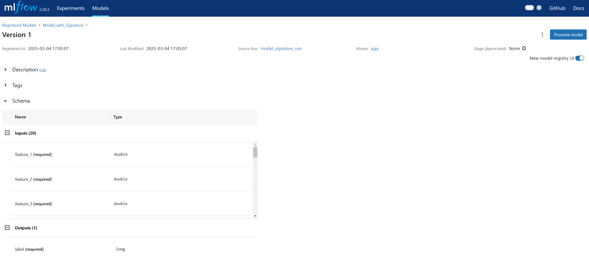

### Create an experiment


```python
from mlflow_utils import create_mlflow_experiment
from mlflow import MlflowClient

from mlflow.types.schema import Schema
from mlflow.types.schema import ColSpec

experiment_id = create_mlflow_experiment(
    experiment_name="model_registry",
    artifact_location="model_registry_artifacts",
    tags={"purpose": "learning"},
)

print(experiment_id)

client = MlflowClient()
model_name = "registered_model_2"
```

    Experiment model_registry already exists.
    533954857939339914
    

### Create a Registerd Model


```python
client.create_registered_model(model_name)
```


    <RegisteredModel: aliases={}, creation_timestamp=1741074787360, description=None, last_updated_timestamp=1741074787360, latest_versions=[], name='registered_model_2', tags={}>




### Add description to registired model.


```python

client.update_registered_model(name=model_name, description="This is a test model")
```


    <RegisteredModel: aliases={}, creation_timestamp=1741074787360, description='This is a test model', last_updated_timestamp=1741074832003, latest_versions=[], name='registered_model_2', tags={}>


### Add tags to registired model.


```python
client.set_registered_model_tag(name=model_name, key="tag1", value="value1")
```


### Create a Model Version

- Creating a new version of the model(`rft_modelx`) with a new name called 'registered_model_2'
- It is basically registering a model if it is the first version.


```python
source = "file:///c:/Users/dof07/Desktop/mlflow/model_registry_artifacts/97a00b6f50504b77a8693cb830d99797/artifacts/rft_modelx"
run_id = "533954857939339914"
client.create_model_version(name=model_name, source=source, run_id=run_id)
```


    <ModelVersion: aliases=[], creation_timestamp=1741074957281, current_stage='None', description=None, last_updated_timestamp=1741074957281, name='registered_model_2', run_id='533954857939339914', run_link=None, source='file:///c:/Users/dof07/Desktop/mlflow/model_registry_artifacts/97a00b6f50504b77a8693cb830d99797/artifacts/rft_modelx', status='READY', status_message=None, tags={}, user_id=None, version=1>


### Add description to model version.


```python
client.update_model_version(name=model_name, version=1, description="This is a test model version")
```


    <ModelVersion: aliases=[], creation_timestamp=1741074957281, current_stage='None', description='This is a test model version', last_updated_timestamp=1741074998633, name='registered_model_2', run_id='533954857939339914', run_link=None, source='file:///c:/Users/dof07/Desktop/mlflow/model_registry_artifacts/97a00b6f50504b77a8693cb830d99797/artifacts/rft_modelx', status='READY', status_message=None, tags={}, user_id=None, version=1>


### Add tags to model version.


```python
client.set_model_version_tag(name=model_name, version=1, key="tag1", value="value1")
```


### Input and output schema can only be included on MLflow ui.

- Since there is a model where you defined model signiture in the previous section, you can registed the model and include the schema to the model


